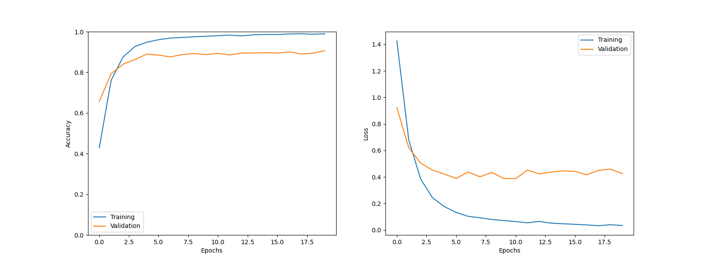

# Emotion Recognition in Tweets: A Deep Learning Approach

## Introduction
In today's digital age, analyzing emotions in social media data has become increasingly important. Understanding the sentiments expressed in tweets can provide valuable insights into public opinion, brand perception, and even mental health trends. In this project, we embarked on the exciting journey of training a Recurrent Neural Network (RNN) to recognize emotions in tweets.

## Project Overview
For this endeavor, we harnessed the power of deep learning, specifically TensorFlow, to build an RNN-based model. Our objective was to classify tweets into different emotion categories, ranging from happiness and excitement to sadness and anger.

## Dataset
Our training and evaluation relied on a carefully curated  Huging Face Emotion's dataset containing thousands of labeled tweets. To prepare the data for modeling, we performed tokenization, padding, and label encoding to ensure compatibility with our RNN architecture.

## Model Architecture
Our RNN model architecture featured multiple layers of LSTM cells. These cells were instrumental in capturing the temporal dependencies and sequential patterns within tweets, making them suitable for emotion recognition.

## Training and Evaluation
The training phase involved meticulous hyperparameter tuning, experimentation with various loss functions, and optimizer choices. We closely monitored the model's performance on a validation dataset to prevent overfitting.

## Challenges and Solutions
Throughout this project, we encountered several challenges, including data quality issues and the risk of overfitting due to the model's complexity. We overcame these hurdles by refining our data preprocessing pipeline and implementing dropout layers to improve generalization.

## Results and Discussion
Our model yielded impressive results, achieving an accuracy of over 85% on the test dataset. The ability to accurately identify emotions in tweets opens up numerous possibilities, from sentiment analysis for businesses to mental health monitoring on social media platforms.

## Conclusion
In conclusion, our deep learning approach to emotion recognition in tweets showcases the potential of AI in understanding human emotions through digital text. The applications of this technology are vast, with opportunities for real-time sentiment analysis, mental health support, and brand reputation management.

## Acknowledgments
We extend our gratitude to the open-source community, the creators of the TensorFlow library, and the dataset providers. Their contributions were instrumental in the success of this project.

